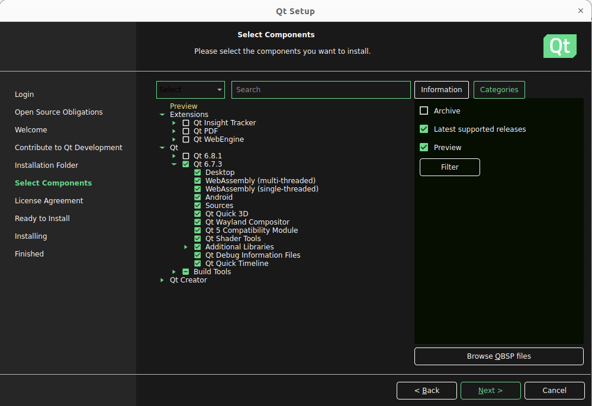
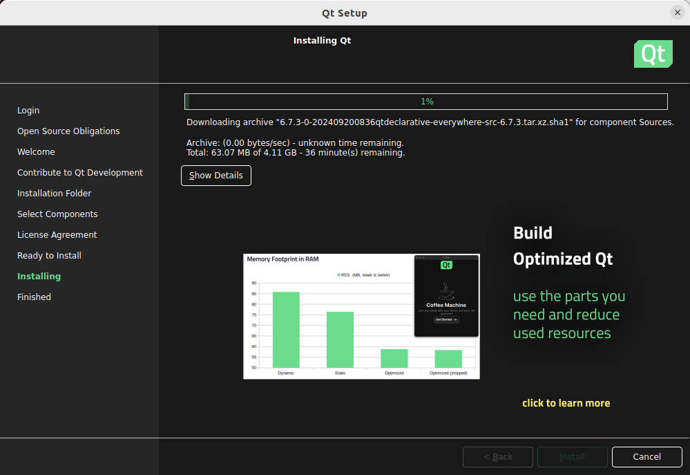

# 客户端环境搭建

需要什么?

1. Qt6
2. protobuf
3. vcpkg去帮助安装protobuf (windows)

> [!TIP]
> vspkg就可以理解成windows上的apt/yum

## 安装Qt6

> https://www.qt.io/download-qt-installer-oss?hsCtaTracking=99d9dd4f-5681-48d2-b096-470725510d34%7C074ddad0-fdef-4e53-8aa8-5e8a876d6ab4

选择安装 `Qt Online Installer`, 注意对应系统的版本 (本项目中我使用Linxu Arm64进行Qt开发)

另外, 需要选择 `Qt Creator`.

